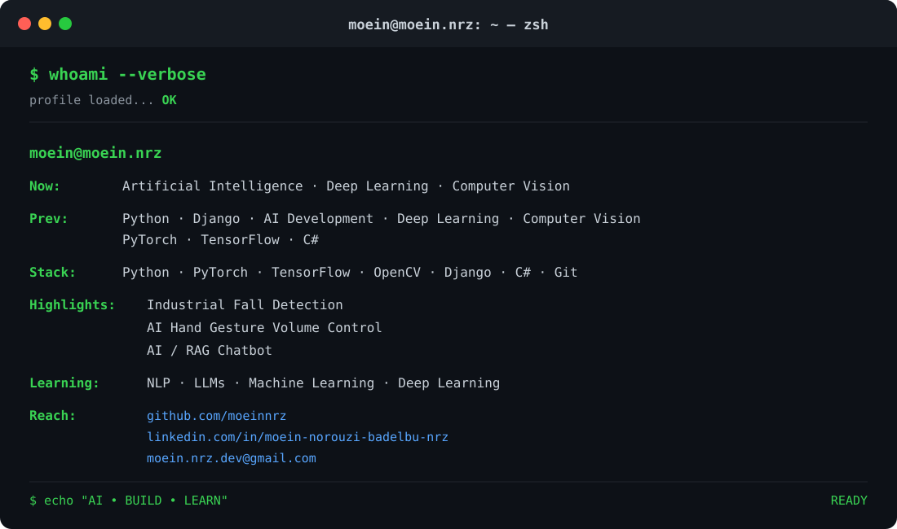
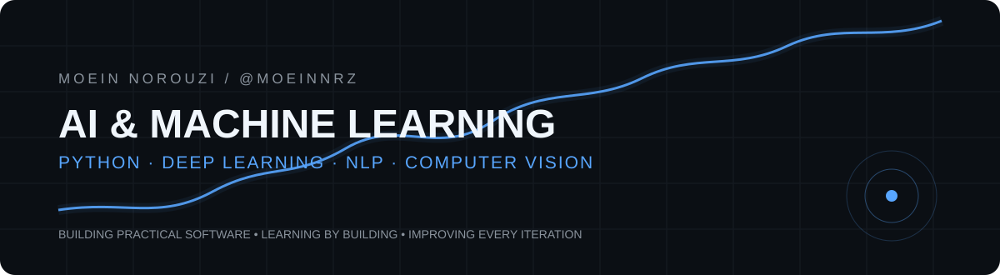
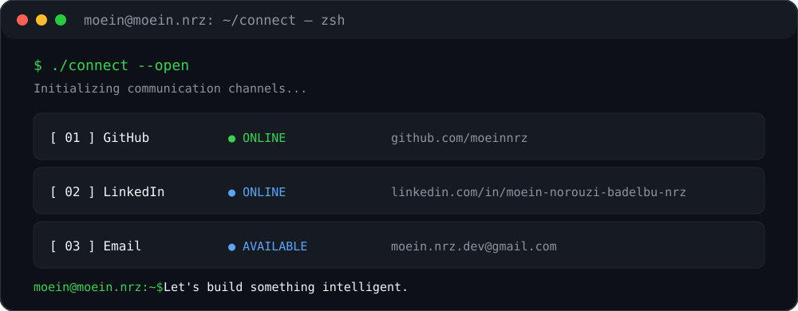

<div align="center">

<h3><code>moein@moein.nrz ~ $ ./contributions.sh</code></h3>

<br><br>
<h3><code>moein@moein.nrz ~ $ whoami</code></h3>

<br>
<h3><code>moein@moein.nrz ~ $ cat contact.txt</code></h3>
<p>
<a href="https://github.com/moeinnrz"></a>
<a href="https://www.linkedin.com/in/moein-norouzi-badelbu-nrz/"></a>
<a href="mailto:moein.nrz.dev@gmail.com"></a>
</p>
<br>
<sub><code>contrib-heatmap.svg</code> is refreshed automatically by GitHub Actions. The terminal art is self-hosted in this repository.</sub>
</div>

---

<div align="center">
  
</div>

<br>

<div align="center">
  <a href="https://github.com/moeinnrz"></a>
  <a href="https://www.linkedin.com/in/moein-norouzi-badelbu-nrz/"></a>
  <a href="mailto:moein.nrz.dev@gmail.com"></a>
  
</div>

<p align="center"><sub>Python · Machine Learning · Deep Learning · NLP · Computer Vision · Backend</sub></p>

---

## `01 / about`

<table>
<tr>
<td width="66%" valign="top">

### Building software. Exploring intelligent systems.

I'm **Moein Norouzi**, a developer working across **Python, C# and AI-focused projects**.

My path has moved from application development and automation toward **Machine Learning, Deep Learning, Computer Vision and NLP**. I like learning by building: taking an idea, turning it into a working system, testing it and improving it through iteration.

**Current direction**

`Python` → `Machine Learning` → `Deep Learning` → `NLP` → `Generative AI`

</td>
<td width="34%" valign="top">

### `focus`

**Artificial Intelligence**  
Machine Learning  
Deep Learning  
Computer Vision  
NLP

**Engineering**  
Python  
C#  
Django / Backend  
Automation

</td>
</tr>
</table>

> **Build useful things. Understand the fundamentals. Improve every iteration.**

---

## `02 / capabilities`

| AI / ML | Software Engineering |
|:--|:--|
| Machine Learning | Python development |
| Deep Learning | C# / desktop applications |
| Neural Networks | Programming fundamentals |
| Computer Vision | Django / backend |
| Natural Language Processing | Automation |
| Generative AI — learning path | Git & GitHub workflows |

---

## `03 / tech stack`

<div align="center">

<pre>
╭──────────────────────────────────────────────────────────────────────────────────────────────╮
│  ● ● ●          moein@moein.nrz: ~/tech-stack — zsh                                         │
╰──────────────────────────────────────────────────────────────────────────────────────────────╯
$ ./skills --verbose

initializing proficiency matrix... <b>OK</b>

┌─ Languages ────────────────────────────────────────────────────────────────────────────────┐
│  Python           ██████████████████░░   90%                                      │
│  C#               █████████████░░░░░░░   65%                                      │
└───────────────────────────────────────────────────────────────────────────────────────────┘

┌─ AI / Data ────────────────────────────────────────────────────────────────────────────────┐
│  PyTorch          ████████████████░░░░   82%                                      │
│  TensorFlow       ████████████████░░░░   80%                                      │
│  OpenCV           ██████████████████░░   90%                                      │
│  Scikit-learn     ████████████████░░░░   78%                                      │
└───────────────────────────────────────────────────────────────────────────────────────────┘

┌─ Backend / Tools ─────────────────────────────────────────────────────────────────────────┐
│  Django           ████████████████░░░░   82%                                      │
│  Docker           ███████████░░░░░░░░░   55%                                      │
│  Git              █████████████████░░░   85%                                      │
│  GitHub           ██████████████████░░   92%                                      │
│  VS Code          ██████████████████░░   92%                                      │
└───────────────────────────────────────────────────────────────────────────────────────────┘

root@moein.nrz:~$ echo "AI • BUILD • LEARN"
READY
</pre>

</div>

> Progress bars are a personal portfolio visualization of current working familiarity, not standardized benchmarks.

---

## `04 / currently learning`

<div align="center">
  
</div>

<p align="center"><sub>Animated learning status — cycles automatically without requiring a page refresh.</sub></p>

---

## `05 / selected work`

<table>
<tr>
<td width="50%" valign="top">

### `01` · Object Detection

Real-time computer vision using **YOLOv8, OpenCV and PyQt5**.

`Python` `YOLOv8` `OpenCV` `PyQt5`

<a href="https://github.com/moeinnrz/Object_Detection">VIEW REPOSITORY →</a>

</td>
<td width="50%" valign="top">

### `02` · Smart Parking Detection

Computer-vision system for detecting **parking occupancy**.

`Python` `OpenCV` `Computer Vision`

<a href="https://github.com/moeinnrz/Smart_Parking_Detection-">VIEW REPOSITORY →</a>

</td>
</tr>
<tr>
<td width="50%" valign="top">

### `03` · Hand Volume Control

Gesture-based desktop interaction using **hand tracking**.

`Python` `Computer Vision` `Automation`

<a href="https://github.com/moeinnrz/Hand_Volume_Control">VIEW REPOSITORY →</a>

</td>
<td width="50%" valign="top">

### `04` · File Locker

C# desktop utility focused on **file protection**.

`C#` `Windows Forms` `Desktop`

<a href="https://github.com/moeinnrz/File_Locker">VIEW REPOSITORY →</a>

</td>
</tr>
<tr>
<td width="50%" valign="top">

### `05` · Windows Calculator

A Windows Forms desktop application built with C#.

`C#` `Windows Forms`

<a href="https://github.com/moeinnrz/Calculator_Windows_Csharp">VIEW REPOSITORY →</a>

</td>
<td width="50%" valign="top">

### `06` · DHCPBreaker

Networking / security learning project implemented in Python.

`Python` `Networking` `Security`

<a href="https://github.com/moeinnrz/DHCP_Starvation_Attack_DHCBreaker">VIEW REPOSITORY →</a>

</td>
</tr>
</table>

---

## `06 / github analytics`

<div align="center">
  
</div>

<p align="center"><sub>Contribution totals, streaks, monthly activity, repository count, stars and language distribution are generated from GitHub data by GitHub Actions.</sub></p>

---

## `07 / contribution activity`

<div align="center">
  
</div>

---

## `08 / contribution snake`

<div align="center">
  <picture>
    <source media="(prefers-color-scheme: dark)" srcset="https://raw.githubusercontent.com/moeinnrz/moeinnrz/gh-pages/github-contribution-grid-snake-dark.svg" />
    <source media="(prefers-color-scheme: light)" srcset="https://raw.githubusercontent.com/moeinnrz/moeinnrz/gh-pages/github-contribution-grid-snake-light.svg" />
    
  </picture>
</div>

---

## `09 / learning roadmap`

<table>
<tr>
<td width="33%" valign="top">

### NOW

`Python`  
`Machine Learning`  
`Deep Learning`  
`Computer Vision`  
`NLP`

</td>
<td width="33%" valign="top">

### NEXT

`Transformers`  
`LLM fundamentals`  
`Model evaluation`  
`Experiment tracking`

</td>
<td width="33%" valign="top">

### LATER

`MLOps`  
`Generative AI`  
`Production ML`  
`AI systems`

</td>
</tr>
</table>

---

## `10 / principles`

```text
01  Learn deeply.
02  Build consistently.
03  Prefer practical systems over demos.
04  Measure → iterate → improve.
```

---

## `11 / connect`

<div align="center">
  
</div>

<p align="center">
  <a href="https://github.com/moeinnrz"></a>
  <a href="https://www.linkedin.com/in/moein-norouzi-badelbu-nrz/"></a>
  <a href="mailto:moein.nrz.dev@gmail.com"></a>
</p>

<p align="center"><sub>Designed as a living developer portfolio · @moeinnrz</sub></p>
