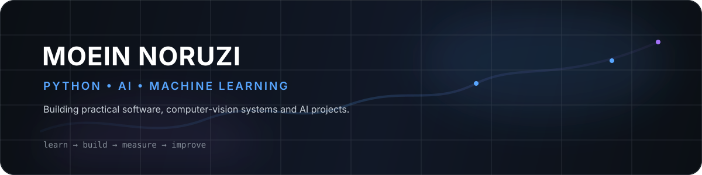

  

 

  
  
  

 

  Python &nbsp;·&nbsp; Machine Learning &nbsp;·&nbsp; Deep Learning &nbsp;·&nbsp; NLP &nbsp;·&nbsp; Computer Vision &nbsp;·&nbsp; Backend

---

## `01 / about`

<table>
<tr>
<td width="65%" valign="top">

### Building with code. Learning through real systems.

I'm **Moein Norouzi**, a developer working with **Python and C#**, with a growing focus on **Artificial Intelligence and Machine Learning**.

My work has taken me from desktop software and automation into **Computer Vision, Deep Learning, Machine Learning and NLP**. I enjoy turning an idea into something that can actually run, be tested and improved.

**Current direction**

`Python` → `Machine Learning` → `Deep Learning` → `NLP` → `Generative AI`

</td>
<td width="35%" valign="top">

### `focus`

**AI / ML**  
Machine Learning  
Deep Learning  
Computer Vision  
NLP

**Engineering**  
Python  
C# / C++  
Django / Backend  
Automation

</td>
</tr>
</table>

> **Build useful things. Understand the fundamentals. Improve every iteration.**

---

## `02 / capabilities`

<table>
<tr>
<td width="50%" valign="top">

### Artificial Intelligence

- Machine Learning
- Deep Learning
- Neural Networks
- Computer Vision
- Natural Language Processing
- Generative AI — learning path

</td>
<td width="50%" valign="top">

### Software Engineering

- Python development
- C# / Windows applications
- C++ fundamentals
- Django / backend development
- Automation
- Git & GitHub workflows

</td>
</tr>
</table>

---

## `03 / tech stack`

### Languages

### AI / Data

### Backend / Tools

---

## `04 / selected work`

<table>
<tr>
<td width="50%" valign="top">

### 🎯 Object Detection

**Real-time computer vision** using YOLOv8, OpenCV and PyQt5.

`Python` `YOLOv8` `OpenCV` `PyQt5`

<a href="https://github.com/moeinnrz/Object_Detection">VIEW REPOSITORY →</a>

</td>
<td width="50%" valign="top">

### 🚗 Smart Parking Detection

Computer-vision system for detecting **parking occupancy**.

`Python` `OpenCV` `Computer Vision`

<a href="https://github.com/moeinnrz/Smart_Parking_Detection-">VIEW REPOSITORY →</a>

</td>
</tr>
<tr>
<td width="50%" valign="top">

### ✋ Hand Volume Control

Gesture-based desktop interaction using **hand tracking**.

`Python` `Computer Vision` `Automation`

<a href="https://github.com/moeinnrz/Hand_Volume_Control">VIEW REPOSITORY →</a>

</td>
<td width="50%" valign="top">

### 🔐 File Locker

C# desktop utility focused on **file protection**.

`C#` `Windows Forms` `Desktop`

<a href="https://github.com/moeinnrz/File_Locker">VIEW REPOSITORY →</a>

</td>
</tr>
<tr>
<td width="50%" valign="top">

### 🧮 Windows Calculator

A Windows Forms desktop application built with C#.

`C#` `Windows Forms`

<a href="https://github.com/moeinnrz/Calculator_Windows_Csharp">VIEW REPOSITORY →</a>

</td>
<td width="50%" valign="top">

### 🛡️ DHCPBreaker

Networking / security learning project implemented in Python.

`Python` `Networking` `Security`

<a href="https://github.com/moeinnrz/DHCP_Starvation_Attack_DHCBreaker">VIEW REPOSITORY →</a>

</td>
</tr>
</table>

---

## `05 / github analytics`

  
  

 

  

---

## `06 / activity`

  

---

## `07 / contribution snake`

  <picture>
    <source media="(prefers-color-scheme: dark)" srcset="https://raw.githubusercontent.com/moeinnrz/moeinnrz/output/github-contribution-grid-snake-dark.svg" />
    <source media="(prefers-color-scheme: light)" srcset="https://raw.githubusercontent.com/moeinnrz/moeinnrz/output/github-contribution-grid-snake.svg" />
    
  </picture>

---

## `08 / learning roadmap`

<table>
<tr>
<td width="33%" valign="top">

### NOW

`Python`  
`Machine Learning`  
`Deep Learning`  
`Computer Vision`  
`NLP`

</td>
<td width="33%" valign="top">

### NEXT

`Transformers`  
`LLM fundamentals`  
`Model evaluation`  
`Experiment tracking`

</td>
<td width="33%" valign="top">

### LATER

`MLOps`  
`Deployment`  
`Production AI`  
`Generative AI`

</td>
</tr>
</table>

---

## `09 / principles`

### **Learn deeply. Build consistently. Ship useful things.**

Curiosity → Practice → Projects → Better systems

---

## `10 / connect`

<a href="https://github.com/moeinnrz">GitHub</a>
&nbsp;&nbsp;·&nbsp;&nbsp;
<a href="https://www.linkedin.com/in/moein-norouzi-badelbu/">LinkedIn</a>

  

Designed for @moeinnrz · built with Markdown, HTML, SVG &amp; GitHub Actions

